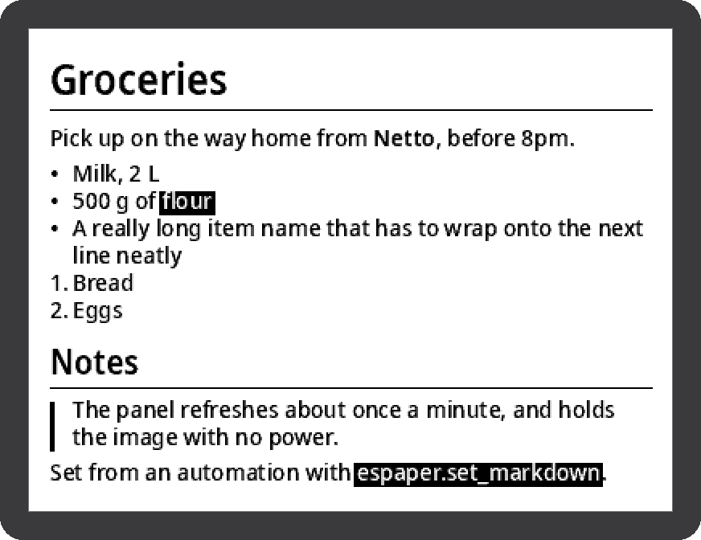

# ESPaper Uploader

A Home Assistant integration for the [BLE e-paper display](../README.md): an
ESP32-H2 driving a 400×300 monochrome panel.

You get a **text entity**, a **dashboard card**, a **switch** and a
**connectivity sensor**. Put Markdown in either box, and the integration renders
it — antialiased, in the panel's four grey levels — and pushes it the next time
the panel wakes up. Once the panel is showing the current text, nothing further
happens — no polling, no reconnecting — until you change the text again.

<p align="center">
  
</p>

That panel is [this Markdown](docs/sample.md):

```markdown
# Groceries

Pick up on the way home from **Netto**, before 8pm.

- Milk, 2 L
- 500 g of `flour`
- A really long item name that has to wrap onto the next line neatly
1. Bread
2. Eggs

## Notes
> The panel refreshes about once a minute, and holds the image with no power.

Set from an automation with `espaper.set_markdown`.
```

## Why it works this way

The board advertises for about two seconds and then deep-sleeps for a minute, so
an upload cannot be scheduled — it has to be caught, and only while the
integration actually owes the panel a frame. An update therefore lands within
about one sleep cycle (~60 s by default), and a failed transfer simply retries on
the next wake.

Catching it means being early, not quick. Reacting to an advertisement is
already too late — by the time it has reached Home Assistant and been noticed, a
good part of the two seconds is gone. But a connect attempt is not an instant
thing: the request stays *pending* for about twenty seconds, and the Bluetooth
controller latches onto the panel's first advertisement in hardware. So the
integration works out when the panel is next due — from the interval Home
Assistant has learned for it, falling back to 62 s — and opens that twenty-second
net a few seconds *before* the wake it is aiming at. One attempt per cycle,
covering the window from both sides.

If the panel has not been heard from for five minutes it is treated as offline
and attempts stop, leaving only the advertisement history being watched once a
minute, which costs a dictionary lookup and no radio at all. That matters most
with an ESPHome Bluetooth proxy: every attempt takes one of its few connection
slots and pauses the scanning that everything else behind it depends on. The
frame is still owed, and goes out on the first cycle after the panel returns —
no attempt limit, nothing to retrigger by hand.

A `binary_sensor` reports that online/offline state, and the text entity carries
it as the `online` and `last_seen` attributes. Text can still be set while the
panel is offline — that is exactly when queueing it matters.

E-paper holds its image without power, so after a Home Assistant restart the
integration compares the restored text with the text it last confirmed on the
panel and stays quiet if they match.

## Install

**HACS** → three-dot menu → *Custom repositories* → add
`https://github.com/n0n3m4/espaper-uploader` as an *Integration*, then install
and restart Home Assistant.

Or copy `custom_components/espaper` into your `config/custom_components/`.

The panel is then auto-discovered (it advertises its vendor service UUID) and
shows up as a Bluetooth discovery in **Settings → Devices & Services** within a
wake cycle. There is no pairing and no token.

## Use

The device gets one entity, `text.espaper_markdown`:

```yaml
automation:
  - trigger:
      - platform: state
        entity_id: sensor.next_bin_collection
    action:
      - action: text.set_value
        target:
          entity_id: text.espaper_markdown
        data:
          value: "# Bins\n\nNext: {{ states('sensor.next_bin_collection') }}"
```

### The card

Home Assistant's text entity is single-line — its `TextMode` has only `text` and
`password`, and the frontend renders an `<input>`, so pressing Enter in the box
is simply not possible (the `input_text` helper has the same limitation). Its
state is also capped at 255 characters. Markdown without line breaks is not much
use, so the integration ships its own card:

```yaml
type: custom:espaper-card
entity: text.espaper_markdown
```

A real textarea, no length cap, with the upload status and a rotation dropdown
underneath. Ctrl+Enter (⌘+Enter on a Mac) sends both. If you edit the text or
the angle somewhere else while you have unsaved changes open, the card says so
rather than overwriting what you typed.

The integration serves the card itself, so there is no Lovelace resource to add
and nothing extra to install. If it does not appear, hard-refresh the browser;
failing that, add `/espaper/espaper-card.js` manually under **Settings →
Dashboards → three-dot menu → Resources** as a JavaScript module.

Options: `entity` (required), `title`, and `rows` (default 10).

### Without the card

**Type `\n` in the text box.** A literal backslash-n is expanded to a real
newline on the way to the panel:

```
# Shopping\n\n- Milk\n- **Eggs**
```

The entity keeps showing exactly what you typed, so editing it round-trips
rather than rewriting itself the first time you save.

**Use a YAML block scalar in an automation**, which gives real newlines:

```yaml
      - action: text.set_value
        target:
          entity_id: text.espaper_markdown
        data:
          value: |
            # Shopping

            - Milk
            - **Eggs**
```

**Use the service**, whose field is a proper multi-line text area in
*Developer Tools → Actions*. This, like the card, has no 255-character cap:

```yaml
      - action: espaper.set_markdown
        target:
          entity_id: text.espaper_markdown
        data:
          markdown: >
            # Today

            
            - {{ e.summary }}
            
```

The entity's attributes show `upload_status` (`idle`, `pending`, `uploading`),
`last_upload`, `last_error`, `rotation`, and `uploaded_markdown` — what the panel
is actually displaying right now.

### Rotation

The dropdown in the card's footer turns the layout 0/90/180/270° clockwise, for
a panel hung on its side or upside down. A quarter turn lays the text out at
300×400 — wrapping, margins and the clipping mark all follow the shape you are
actually reading — and the frame is turned back to the panel's own 400×300 on
the way out, so the firmware never learns about it. The choice survives a
restart.

In the card the dropdown is part of the draft, like the textarea: moving it says
*unsaved changes* and one **Send** commits the text and the angle together. That
is deliberate — a dropdown that repainted on `change` would send the angle you
picked with the wording you had not sent yet.

The service has no draft to wait for, so it repaints straight away. From an
automation, or *Developer Tools → Actions*:

```yaml
      - action: espaper.set_rotation
        target:
          entity_id: text.espaper_markdown
        data:
          rotation: 90
```

### The 4 colours switch

The panel has four levels, not two, so text is drawn antialiased and quantised
onto them: **on by default**, which is `switch.espaper_4_colours`. Turn it off
for black and white — hard-edged glyphs, and half the bytes. Either way the
frame is repainted immediately, and a board whose firmware only reports 1 bpp
gets black and white whatever the switch says.

### Letting an LLM read and write the note

[extended_openai_conversation](https://github.com/jekalmin/extended_openai_conversation)
can drive the note through two of its custom functions — one to read, one to
write. Paste this into **Settings → Devices & Services → Extended OpenAI
Conversation → Configure → Functions**:

```yaml
- spec:
    name: get_notes
    description: Read the full text currently shown on the e-paper note.
    parameters:
      type: object
      properties: {}
  function:
    type: template
    value_template: "{{ state_attr('text.espaper_markdown', 'full_markdown') }}"

- spec:
    name: set_notes
    description: >-
      Replace the entire e-paper note. Markdown, newlines allowed. This
      overwrites everything, so call get_notes first when adding to or
      editing what is already there.
    parameters:
      type: object
      properties:
        markdown:
          type: string
          description: "Full note in Markdown: # headings, - bullets, **bold**."
      required: [markdown]
  function:
    type: script
    sequence:
      - action: espaper.set_markdown
        target:
          entity_id: text.espaper_markdown
        data:
          markdown: "{{ markdown }}"
```

Change `text.espaper_markdown` to your own entity id if the device was named
something else.

Read goes through the `full_markdown` attribute rather than the state because
the state is capped at 255 characters, and write goes through `espaper.set_markdown`
rather than `text.set_value` for the same reason. If you keep the stock
`execute_services` function alongside these, tell the model in the prompt to
use `set_notes` for the panel — otherwise it will sometimes reach for
`text.set_value` and silently truncate a long list.

**On template injection.** A note containing `{{ ... }}` is not a hole: the
argument is substituted into `{{ markdown }}` in a single render pass, and
Jinja does not re-render its own output, so the braces reach the panel as
literal text. Note content never becomes template *source* anywhere in this
path. The risk that is real is prompt injection in the other direction —
`get_notes` feeds the note back to the model, so anyone who can write a note
(including the model itself, and anything an automation pastes in) can put
instructions in front of it. That matters only in proportion to what else the
conversation agent is allowed to call.

## Supported Markdown

A deliberate subset, chosen for what stays legible on a 400×300 panel:

| Syntax | Rendered as |
|---|---|
| `# ## ###` | Headings, 26/22/18 px semibold; `#` and `##` get a rule under them |
| `- item` / `* item` | Bullet, hanging indent |
| `1. item` | Numbered, hanging indent |
| `**bold**`, `*italic*` | Semibold (see below) |
| `` `code` `` | White-on-black box |
| `> quote` | Indented, with a bar down the whole quote |
| `---` | Horizontal rule |
| blank line | Paragraph gap |

Text that runs past the bottom of the panel is clipped, and a `…` is drawn in the
corner so it is obvious something was cut.

There is no italic cut of the bundled font, and a synthetic skew turns to mush
at this size, so `*italic*` renders as semibold — emphasis is shown, just not
distinguished from `**bold**`.

## Rendering notes

The font is **Noto Sans SemiCondensed Medium**, bundled from
[Inkycal](https://github.com/aceinnolab/Inkycal) (SIL Open Font License, see
`custom_components/espaper/fonts/`). Semicondensed fits noticeably more
characters per line; *Medium* rather than Regular because Regular's thin stems
break up in black and white.

Layout happens once, on an antialiased greyscale canvas; only the last step
differs between the two depths. Three things matter more than they look like
they should:

- In 4 colours the canvas is quantised to the levels the panel actually
  produces — **210, 180, 100, 40**, measured, and nowhere near evenly spaced.
  Nearest level per pixel, no dithering: error diffusion is for photographs,
  and on text it only scatters noise through the edges antialiasing just placed.
  The canvas value is read as *coverage* between 40 and 210 rather than as an
  absolute luminance, because that is what an antialiased edge pixel means —
  so many parts paper, the rest ink. Without it, everything darker or lighter
  than the panel can reproduce piles up on the two end levels.
- Body text is **16.375 px**, and the fraction is not a typo. The bundled face
  is ttfautohint output, which carries no horizontal hinting, so whether a
  vertical stem lands on the pixel grid is decided by the size alone — and not
  monotonically. Stem-to-stem variation is ~5.5 % at 16.375 against 8.7 % at
  16.0 and 7.0 % at 17.0, all three at the same 21 px pitch and the same 13
  lines per panel, so the fraction is free. Headings follow at 29.75 / 26 / 21
  on the same basis. `CLAUDE.md` has the measurement method; don't retune these
  by eye.
- In black and white the same canvas is thresholded at 160, not 128. Biasing
  above mid-grey turns marginal edge pixels into ink, which thickens stems
  slightly instead of eroding them. That compensation is exactly what 4 colours
  makes unnecessary.
- Line pitch comes from the *ink* band (`getbbox("Ag")`), not from the font's
  ascent + descent. Noto's built-in line gap is generous, and on a 300 px panel
  that generosity costs about three lines of text.

Structure is carried by rules rather than whitespace — a 300 px panel cannot
spare the blank pixels it would take to separate sections by margin alone, so
`#` and `##` get a hairline under them and block quotes get a bar down the side.

Regenerate the image above with `python docs/make_preview.py` after changing
anything in `render.py`.

## Troubleshooting

Add this to `configuration.yaml` and restart, then watch **Settings → System →
Logs** (or `home-assistant.log`):

```yaml
logger:
  default: warning
  logs:
    custom_components.espaper: debug
    homeassistant.components.bluetooth: debug
```

A healthy update looks like this:

```
espaper AA:BB:...: new markdown set, queueing upload
espaper AA:BB:...: uploading 96 characters of markdown in 4 colours
espaper AA:BB:...: panel 400x300, 2 bpp, sleeps 60s between adverts
espaper AA:BB:...: sending 3961 of 30000 bytes (4 colours, deflate=True), crc32=0x..., chunk=249
espaper AA:BB:...: state=DONE err=NONE received=3961
espaper AA:BB:...: upload confirmed by the panel
```

The frame is deflated whenever that comes out smaller — automatically, decided
per frame, never configured — which for a page of rendered text means well under
a fifth of the bytes and of the time on air. That is what keeps 4 colours cheap:
the raw frame doubles to 30000 bytes, but large flat white areas compress, so
what actually goes over the radio grows far less. The panel
is only awake ~2 s a minute, so a shorter upload is also a likelier one. The
firmware inflates it from the ESP32-H2 ROM's copy of miniz; if it ever reports
`err=INFLATE` the stream passed its CRC but did not decompress, which means the
two sides disagree about the format rather than that the radio dropped
something.

Reading the state:

| Symptom | Meaning |
|---|---|
| `next attempt in 34s` | Normal — that is the aim, a few seconds ahead of the panel's next wake. |
| `upload failed: ...` then `next attempt in 54s` | Also normal: the net was open but the panel did not turn up in it. Expect the odd one. |
| `next attempt in 60s (panel offline)` | Nothing heard from the panel for five minutes: it is off, flat, out of range, or the adapter is down. The frame stays queued and goes out when it returns. |
| `panel online` / `panel offline` | The connectivity sensor changing state. |
| Nothing at all after setting text | The entity is not reaching the coordinator. Check the entity actually changed in *Developer Tools → States*. |
| `no BLE device known yet, waiting` | Home Assistant has never seen the board. Check the adapter, and that the firmware is advertising. |
| `state=ERROR err=CRC_MISMATCH` | The transfer corrupted. Retries automatically. |
| `state=ERROR err=BAD_GEOMETRY` | Firmware and renderer disagree on panel size — file a bug. |
| `state=ERROR err=BAD_LENGTH` after turning on 4 colours | The firmware predates 2bpp or deflate. Flash the current build, or turn the switch off. |
| `panel advertises 1 bpp, sending black and white` | Older firmware; harmless, and the switch stays on for when it is updated. |
| The card is missing from the picker | Open `/espaper/espaper-card.js` in a browser tab. A 404 means the integration never registered it — the log says `dashboard card served at ...` on a good start, and warns if `www/espaper-card.js` is missing from the install. If it serves fine, it is the frontend cache: hard-refresh (Ctrl+Shift+R), or **Developer Tools → Application → Clear site data**. |
| Stuck at `pending` forever | Look for the `next attempt in ...` lines. If they are absent, nothing is armed — that is a bug, please report it. |
| Stuck at `uploading` forever | Should be impossible: every upload failure is caught and re-armed. If it happens, the log has a traceback — please report it. |

The entity's `upload_status` attribute shows the same state without touching
the logs.

## Development

```sh
python test_render.py       # layout and packing; needs only Pillow
python test_coordinator.py  # the upload-once latch; needs homeassistant importable
node test_card.mjs          # the card's sync rule; needs only node
```

Preview a layout without any hardware:

```sh
python custom_components/espaper/render.py notes.md preview.png
```

Push to a real panel without Home Assistant, to check the protocol port against
the firmware:

```sh
python custom_components/espaper/epaper.py notes.md
```

## Licence

MIT, except the bundled Noto fonts, which are under the SIL Open Font License
1.1 (`custom_components/espaper/fonts/LICENSE_OFL.txt`).
